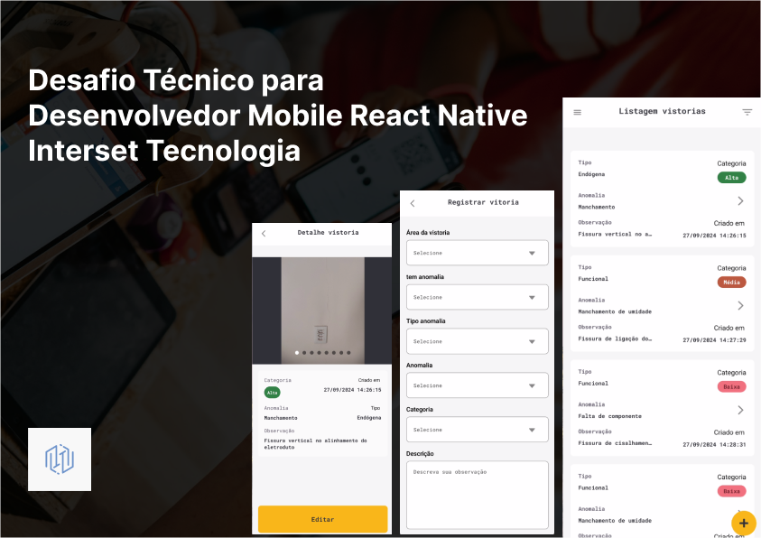

# 

O desafio consiste em mostrar o conhecimento em sincronização de dados online e offline, assim como realizar o crud e filtros em vistorias como a listagem de clientes.

#### Desenvolvimento das telas do aplicativo:

[Figma](https://www.figma.com/design/ccRGzZ5Qj1sErvAHGc626x/Desafio-T%C3%A9cnico-para-Desenvolvedor-Mobile-React-Native--Interset-Tecnologia?node-id=41-2&t=6AgeGY02UPdmHjDu-1)

#### Tecnologias necessárias para rodar o projeto:

| Ferramenta   | Versão                         |
| ------------ | ------------------------------ |
| NodeJS (LTS) | v21.7.1                        |
| react-native | 0.74.5                         |
| EXPO         | ~51.0.28                       |
| Java         | openjdk 17.0.12 2024-07-16 LTS |

###3 Foi utilizado expo na sua versão SDK 51 com as respectivas bibliotecas:

-   [x] Zustand - Para controlar o estado da modal de sincronização.
-   [x] NetInfo - Para identificar quando está conectado a uma rede ou dado móvel.
-   [x] HookForm - Para validar o formulário de cadastro e edição.
-   [x] reactQuery - Para controlar melhor estado das request.
-   [] expo-sqlite - Para criar um banco local para guardar as informações tanto online como offline.

## 🖥️Como utilizar projeto

```cm
git clone (link do repositório)
```

#### Instale as dependências

```cm
yarn
```

#### crie um .env na raiz do seu projeto

```cm
EXPO_PUBLIC_BASE_URL = sua credencial
```

#### execute no android

```cm
yarn android
```

#### execute no ios

```cm
cd ios && pod install && cd..
yarn ios
```

[Linkedin](https://www.linkedin.com/in/italoasouzati/)
